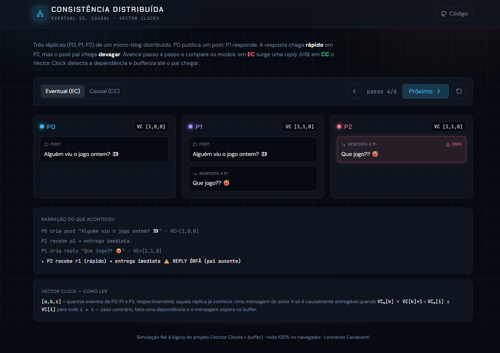

# Twitter SD — Consistência Eventual (EC) e Consistência Causal (CC)

Implementação de um **Twitter simplificado** com 3 réplicas (P0, P1, P2) para demonstrar, na prática, a diferença entre:

- **EC (Eventual Consistency)**: permite que uma *reply* chegue antes do post pai ⇒ aparece como **reply órfã**.
- **CC (Causal Consistency)**: usa **Relógio Vetorial** + **buffer** ⇒ *reply* só é entregue quando as **dependências causais** estiverem satisfeitas (não existe reply órfã).

### Visualização interativa (ao vivo)

[](https://leonardopcavalcanti.github.io/distributed-twitter-consistency/)

**[leonardopcavalcanti.github.io/distributed-twitter-consistency](https://leonardopcavalcanti.github.io/distributed-twitter-consistency/)** — simulador web que mostra, passo a passo, as 3 réplicas e seus Vector Clocks: alterne entre EC e CC e veja a **reply órfã** surgir na consistência eventual e ser **bufferizada** na causal.

> A visualização (em [`viz/`](viz/)) reexecuta a mesma lógica (Vector Clocks + buffer causal) em TypeScript, rodando 100% no navegador. Ótima como apoio didático para a disciplina de Sistemas Distribuídos.

---

## O que este projeto ensina

> Em um sistema distribuído **não existe relógio global** nem ordem natural dos eventos: cada réplica só conhece o que viu até agora. Este projeto torna visível como recuperar a **ordem causal** mesmo sem um relógio compartilhado — e o que acontece quando você não a recupera.

### 1. A relação "aconteceu-antes" (happened-before)
Definida por **Lamport (1978)**, escreve-se `a → b` ("a aconteceu antes de b") quando:
1. `a` e `b` são do mesmo processo e `a` veio primeiro; ou
2. `a` é o **envio** de uma mensagem e `b` é o **recebimento** dela; ou
3. por transitividade (`a → b` e `b → c` ⇒ `a → c`).

Um *post* e a *reply* que o responde têm uma dependência causal: `post → reply`. Se uma réplica entrega a reply **antes** do post, ela violou a causalidade — é a **reply órfã**.

### 2. Relógio Vetorial (Vector Clock)
Cada réplica mantém um vetor com um contador por réplica, ex.: `[P0, P1, P2]`.
- Ao gerar um evento local, incrementa **sua própria** posição.
- Ao enviar, anexa uma cópia do vetor à mensagem.
- Ao receber, faz o **máximo elemento-a-elemento** entre o seu vetor e o da mensagem.

A grande propriedade: comparando dois vetores dá para saber se `a → b`, `b → a`, ou se são **concorrentes** (nenhum causou o outro) — algo que um único contador (relógio de Lamport escalar) não consegue distinguir.

### 3. A condição de entrega causal (causal delivery)
Na versão **CC**, uma reply de `Pj` com relógio `VC_msg` só é **entregue** quando a réplica local já viu **todas as dependências**:
```
VC_msg[j] == VC_local[j] + 1     (é a próxima mensagem esperada de Pj)
VC_msg[k] <= VC_local[k]   ∀k≠j  (já vi tudo de que esta mensagem depende)
```
Se a condição falha, a mensagem vai para um **buffer** e é re-testada a cada nova entrega — até que o post pai chegue. Por isso, em CC, **nunca há reply órfã**.

### 4. O trade-off que o projeto demonstra
- **EC (eventual):** entrega imediata, máxima disponibilidade, mas pode mostrar estados que violam causalidade (a reply órfã). As réplicas convergem *eventualmente*.
- **CC (causal):** preserva a ordem de causa-e-efeito, ao custo de **segurar** mensagens no buffer (latência). É o ponto-ótimo para timelines, chats e comentários, onde "resposta antes da pergunta" é inaceitável.

Este é, em miniatura, o mesmo dilema **consistência × disponibilidade × latência** que governa bancos distribuídos reais.

### O cenário, desenhado

A mesma sequência de mensagens — P0 posta, P1 responde — chegando **fora de ordem** em P2:

```mermaid
sequenceDiagram
    autonumber
    participant P0 as P0 (posta)
    participant P1 as P1 (responde)
    participant P2 as P2 (observa)

    P0->>P1: post "Oi!" — VC [1,0,0]
    Note over P1: entrega o post<br/>VC local: [1,1,0] ao responder
    P1-->>P2: reply "Oi de volta!" — VC [1,1,0] (chega PRIMEIRO)
    P0-->>P2: post "Oi!" — VC [1,0,0] (chega DEPOIS, atrasado)

    rect rgb(60, 25, 30)
        Note over P2: EC — entrega imediata:<br/>reply aparece SEM o post pai (reply órfã)
    end
    rect rgb(20, 45, 40)
        Note over P2: CC — verifica VC [1,1,0]: depende de P0=1,<br/>mas VC local é [0,0,0] → BUFFERIZA.<br/>Post chega → entrega post, drena buffer → reply.<br/>Ordem causal preservada.
    end
```



**Leituras de referência:**
- Leslie Lamport (1978) — [*Time, Clocks, and the Ordering of Events in a Distributed System*](https://lamport.azurewebsites.net/pubs/time-clocks.pdf).
- Tanenbaum & Van Steen — *Distributed Systems*, capítulo de relógios lógicos e consistência.

---

## Estrutura do projeto

```
twitter_sd/
├── README.md
├── requirements.txt
├── setup.sh
├── logs/                         # gerado pelo setup.sh
├── src/
│   ├── __init__.py
│   ├── config.py                 # portas e URLs base (P0/P1/P2)
│   ├── models.py                 # modelo Event (post/reply) + campos de VC (CC)
│   ├── net.py                    # async_send (envio HTTP assíncrono + delay opcional)
│   ├── storage.py                # FeedState (posts, replies, impressão do feed)
│   ├── twitter_eventual.py       # versão EC (aceita chegada em qualquer ordem)
│   └── twitter_causal.py         # versão CC (VC + buffer + liberação do buffer)
└── tests/
    ├── test_ec.sh                # cenário EC (gera reply órfã em P2)
    └── test_cc.sh                # cenário CC (P2 bufferiza e só entrega depois)
```

> Obs.: as pastas `logs/` e arquivos `.pid` são criados automaticamente pelo `setup.sh`.

---

## Como executar

### 1) Criar e ativar venv

```bash
python3 -m venv venv
source venv/bin/activate
```

### 2) Instalar dependências

```bash
pip install -r requirements.txt
```

### 3) Subir as 3 réplicas (EC ou CC) com o setup

```bash
chmod +x setup.sh
./setup.sh ec
# ou
./setup.sh cc
```

Ao final, você deve ver algo como:
- P0 em `127.0.0.1:8080`
- P1 em `127.0.0.1:8081`
- P2 em `127.0.0.1:8082`

E os logs em:
```bash
tail -f logs/p0.log
tail -f logs/p1.log
tail -f logs/p2.log
```

### 4) Rodar os testes

```bash
chmod +x tests/test_ec.sh tests/test_cc.sh

# EC (espera reply órfã em P2)
./tests/test_ec.sh

# CC (P2 bufferiza e só entrega depois)
./tests/test_cc.sh
```

---

## O que esperar nos resultados

### EC — reply órfã (permitido)

No EC, o teste força um atraso (P0 → P2) para o **post pai**.
Como consequência, P2 pode receber primeiro a reply e exibir:

- bloco indicando **REPLIES ÓRFÃS** (ou equivalente)
- depois, quando o pai chega, P2 **converge** e associa a reply ao post.

### CC — sem reply órfã (bloqueado)

No CC, a reply que chega “cedo” falha na condição causal (relógio vetorial) e é:

- **ADIADA / BUFFERIZADA**
- **entregue automaticamente** assim que o post pai chegar (quando a causalidade fica satisfeita)

---

## Arquivos principais (resumo rápido)

- `src/twitter_eventual.py`  
  Réplica EC: entrega mensagens imediatamente (mesmo fora de ordem).

- `src/twitter_causal.py`  
  Réplica CC: usa **Vector Clock**, checagem `is_causally_ready()` e `buffer` para adiar eventos.

- `src/net.py`  
  Envio HTTP assíncrono (thread) e **delay opcional** para simular latência.

- `src/storage.py`  
  Estado do feed: guarda posts/replies e imprime o feed no console.

- `src/models.py`  
  `Event`: `evtId`, `parentEvtId`, `author`, `text`, `processId` e `vectorClock` (no CC).

- `src/config.py`  
  `NUM_PROCESSES`, `base_url(pid)` e `port_of(pid)`.

---

## Limpar ambiente

Para parar as réplicas iniciadas pelo `setup.sh`:

```bash
./setup.sh stop
```

Se preferir manual:
```bash
# mata processos pelos PIDs criados
kill $(cat logs/p0.pid) 2>/dev/null || true
kill $(cat logs/p1.pid) 2>/dev/null || true
kill $(cat logs/p2.pid) 2>/dev/null || true
```

---

## Dicas rápidas de troubleshooting

- **"address already in use"**: tinha uma réplica antiga rodando. Rode:
  ```bash
  ./setup.sh stop
  ```
  e execute o setup novamente.

- **curl dá connection refused**: espere 1–2s e verifique `/health`:
  ```bash
  curl http://127.0.0.1:8080/health
  curl http://127.0.0.1:8081/health
  curl http://127.0.0.1:8082/health
  ```

---

Pronto: com EC você vê **reply órfã**; com CC você vê **buffer + entrega causal**.
